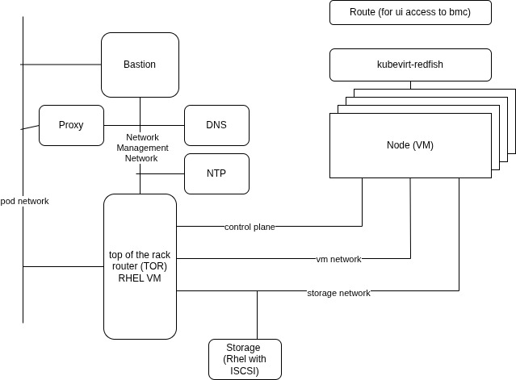

# openshift-baremetal-lab

these insructions will setup a lab with the following architecture:



## quick instructions

Start the `Product Enablement: OpenShift Virtualization and Migration Lab` demo lab and log in to the cluster.

Make master schedulable (only needed if using the above lab which is small)

```sh
oc patch schedulers.config.openshift.io cluster --type='json' -p='[{"op": "replace", "path": "/spec/mastersSchedulable", "value":true}]'
```

Enable wildcard routes:

```sh
oc patch ingresscontroller/default -n openshift-ingress-operator --type=merge -p '{"spec":{"routeAdmission":{"wildcardPolicy":"WildcardsAllowed", "namespaceOwnership":"InterNamespaceAllowed"}}}'
```


### deploy kubevirt-redfish

```sh
helm repo add v1k0d3n https://v1k0d3n.github.io/charts
helm repo update
#there is a bug in this chart...
helm install kubevirt-redfish v1k0d3n/kubevirt-redfish -n kubevirt-redfish --create-namespace -f ./kubevirt-redfish/values.yaml
```

### deploy lab helm chart

create a secret with your public key to be able to access the VMs

```sh
oc new-project bm-lab
oc create secret generic mykey --from-file=key1=${HOME}/.ssh/id_rsa.pub -n bm-lab
```

```sh
helm upgrade -i bm-lab ./charts/bmh-vm -n bm-lab --create-namespace --set sshPublicKeySecretName=mykey --set password=mypwd --set hostingClusterBaseDomain=$(oc get dns.config/cluster -o jsonpath='{.spec.baseDomain}')
```

connect via ssh to bastion, storage, switch

add this to you `.ssh.config`

```sh
Host *.cnv
  IdentityFile .ssh/id_rsa
  ProxyCommand virtctl port-forward --stdio=true vmi/$(echo %h| awk -F'.' '{print $1}').$(echo %h| awk -F'.' '{print $2}') %p
  UserKnownHostsFile=/dev/null
  StrictHostKeyChecking no
```

```sh
ssh fedora@bastion.bm-lab.cnv
ssh fedora@storage.bm-lab.cnv
ssh fedora@switch.bm-lab.cnv
```


## uninstallation

```sh
helm uninstall bm-lab -n bm-lab
oc delete namespace bm-lab
```
