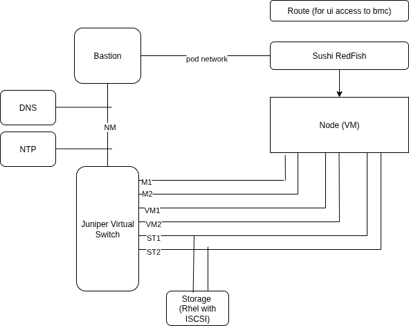

# openshift-baremetal-lab

these insructions will setup a lab with the following architecture:



## quick instructions

Start the `Product Enablement: OpenShift Virtualization and Migration Lab` demo lab and log in to the cluster.

Make master schedulable (only needed if using the above lab which is small)

```sh
oc patch schedulers.config.openshift.io cluster --type='json' -p='[{"op": "replace", "path": "/spec/mastersSchedulable", "value":true}]'
```


### deploy kyverno

```sh
helm repo add kyverno https://kyverno.github.io/kyverno/
helm repo update
helm install kyverno kyverno/kyverno -n kyverno --create-namespace
```

### deploy bmc kyverno policy

```sh
oc apply -f ./kyverno/bmc-emulation-policy.yaml
```

### deploy lab helm chart

create a secret with your public key to be able to access the VMs

```sh
oc new-project bm-lab
oc create secret generic mykey --from-file=key1=${HOME}/.ssh/id_rsa.pub -n bm-lab
oc create secret docker-registry quay --docker-username=xxx --docker-password=xxx --docker-email=xxx --docker-server=quay.io -n bm-lab
```

```sh
helm upgrade -i bm-lab ./charts/bmh-vm -n bm-lab --create-namespace --set sshPublicKeySecretName=mykey --set password=mypwd
```


connect via ssh to bastion, storage, switch

```sh
kubectl port-forward -n bm-lab service/bastion-ssh 10023:22 &
ssh -p 10023 fedora@localhost

kubectl port-forward -n bm-lab service/storage-ssh 10024:22 &
ssh -p 10024 fedora@localhost

kubectl port-forward -n bm-lab service/switch-ssh 10025:22 &
ssh -p 10025 admin@localhost
```


## uninstallation

```sh
helm uninstall bm-lab -n bm-lab
oc delete namespace bm-lab
```